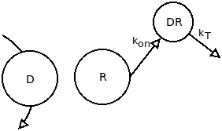

```{r setup, include=FALSE}
knitr::opts_chunk$set(echo = TRUE)
library(deSolve)
```

# Doel.

Het implementeren van een model voor de expressie van glucocorticoid receptoren (GR), waarbij er remming (negatieve feedback) optreed door corticosteroiden.

# Achtergrond.

Glucocorticosteroiden zijn de meest effectieve ontstekingsremmende medicijnen die beschikbaar zijn. Ze zijn sterk voor de behandeling tegen chronische ontstekings- en immuunziekten, waaronder astma. Echter, andere ontstekings ziekten als chronische obstructieve longziekte (COPD), interstitiële pulmonale fibrose en cystische fibrose, lijken grotendeels glucocorticoïde resistent te zijn. Ook is er een kleine groep patiënten die niet of nauwelijks reageert op hoge doses glucocorticoides.

Astma en COPD zijn allebei chronische ontsteking van de luchtwegen, met de activering en rekrutering van vele ontstekingscellen en georganiseerd door een complex netwerk. Echter, er zijn verschillen in de aard van de ontsteking en de ontstekingsgevolgen ervan. Dit zorgt er waarschijnlijk voor waarom Astma goed reageert op een behandeling met glucocorticosteroiden en COPD niet. Door nieuwe inzichten kan beter worden onderzocht waarom Glucocorticosteroiden op de ene ontstekingsziekte wel aanslaat en op de ander niet, en kan er wordt gekeken hoe de Glucocorticosteroiden resistentie overwonnen kan worden.

Door het observeren van ontsteking-repressie door Glucocorticosteroiden bij astma patiënten, zijn er grote inzichten gekomen in het begrijpen van het moleculaire mechanismes van Glucocorticosteroiden. Glucocorticosteroiden activeren veel ontstekingsremmende genen en onderdrukken de ontstekingsbevorderende genen, en heeft meerdere post-transcriptionele effecten.

Glucocorticosteroiden diffuseren door het celmembraan en binden aan de glucocorticoiden receptoren (GR) in het cytoplasma. Na ligand-binding wordt GR geactiveerd en vrijgegeven uit chaperonne-eiwitten (heat shock eiwttien en andere) en wordt het snel getransloceerd naar de kern waar ze hun moleculaire effecten uitoefenen. GR vormen een homodimeer en binden aan het glucocorticoid response element (GRE) op de promotor regio van glucocorticoide responsieve genen. Deze interactie schakelt de gen transcriptie aan of uit van het desbetreffende gen.

\newpage

# Model.

Het model bestaat uit veel onderdelen die nauw verbonden zijn, dit is the zien in het onderstaande figuur.

{width="165"}

Uit dit figuur zijn 4 formules te halen die gebruikt kunnen worden om het model op te bouwen.

{width="388"}

voor elke formule kunnen wij een deel van het volledige model (figuur 1) gebruiken.

## Formule 1.

{width="206"}

uit dit gedeelte is de concentratie van receptor (R) mRNA te achterhalen. Hierin staat:

-   mRNA~R~ = De hoeveelheid mRNA verantwoordelijk voor de aanmaak van receptoren in de cel gemeten in fmol/g lever.

-   DR(N) = De hoeveelheid MPL-receptor complex gemeten in fmol/mg eiwit.

-   k~s_Rm~ = Aanmaak van receptor mRNA gemeten in fmol/g lever/u.

-   k~d_Rm~ = Afbraak van receptor mRNA gemeten als een ratio.

-   IC~50_Rm~ = de concentratie DR(N) waarmee de aanmaak van mRNA word onderdrukt gemeten in fmol/mg eiwit.

## Formule 2.

{width="189"}

Hier uit is te zien hoe de dichtheid van vrije receptoren in het cytosol berekend wordt. Hier staat:

-   R = De dichtheid van vrije receptoren in fmol/mg eiwit.

-   D = De concentratie van MPL in nmol/L.

-   DR = De concentratie van receptoren in een complex met MPL buiten de celkern in fmol/mg eiwit.

-   DR(N) = De dichtheid van MPL-receptor complexen in de celkern gemeten in fmol/mg eiwit.

-   k~s_R~ = Een snelheidsconstante voor de aanmaak van receptoren per uur.

-   k~d_R~ = Een snelheidsconstante voor de afbraak van receptoren per uur.

-   k~on~ = Een snelheidsconstante voor de vorming van MPL-receptor complexen in nmol/L/u.

-   k~re~ = Een snelheidsconstante voor het herstel van MPL-receptor complexen uit de celkern per uur.

-   Rf = Het deel van de MPL-receptor complexen die hergebruikt kunnen worden als vrije receptoren.

## Formule 3.



met dit deel van het model is te zien hoe de dichtheid van MPL-receptor te achterhalen is. Hier staat:

-   DR = De concentratie van receptoren in een complex met MPL buiten de celkern in fmol/mg eiwit.

-   R = De dichtheid van vrije receptoren in fmol/mg eiwit.

-   D = De concentratie van MPL in nmol/L.

-   DR(N) = De dichtheid van MPL-receptor complexen in de celkern gemeten in fmol/mg eiwit.

-   k~on~ = Een snelheidsconstante voor de vorming van MPL-receptor complexen in nmol/L/u.

-   k~T~ = Een snelheidsconstante voor de verplaatsing van MPL-receptor complexen naar de celkern per uur.

## Formule 4.

{width="215"}

Uit dit model is de hoeveelheid MPL-receptor complex in de celkern te achterhalen. Notitie: in de afbeelding staat Rf maar deze komt niet voor in de formule omdat Rf en (1-Rf) tegen elkaar weg te strepen zijn en alleen de 1 overblijft. De waarden staan voor:

-   DR(N) = De dichtheid van MPL-receptor complexen in de celkern gemeten in fmol/mg eiwit.

-   DR = De concentratie van receptoren in een complex met MPL buiten de celkern in fmol/mg eiwit.

-   R = De dichtheid van vrije receptoren in fmol/mg eiwit.

-   k~T~ = Een snelheidsconstante voor de verplaatsing van MPL-receptor complexen naar de celkern per uur.

-   Rf = Het deel van de MPL-receptor complexen die hergebruikt kunnen worden als vrije receptoren.

-   k~re~ = Een snelheidsconstante voor het herstel van MPL-receptor complexen uit de celkern per uur.

```{r, Model, include=FALSE}
# Parameters
parameters <- c(ks_Rm = 2.90, # fmol/g liver/h
                IC50_Rm = 26.2, # fmol/mg protein
                kon = 0.00329, # L/nmol/h
                kT = 0.63, # 1/h
                kre = 0.57, # 1/h
                Rf = 0.49,
                kd_R = 0.0572, # 1/h
                kd_Rm = 0.612,
                ks_R = 3.22,
                D = 53,409) # nmol/L

# Initial state
state <- c(Rmo = 4.74, # fmol/g liver
           Ro = 267, # fmol/mg protein
           DR = 0, # fmol/ mg protein
           DRN = 0) # fmol/mg protein
# Model
GR <- function(t, state, parms){
  with(as.list(c(state, parms)),{
    dmRNAR <- ks_Rm * (1 - DRN/(IC50_Rm + DRN)) - kd_Rm * Rmo
    dR <- ks_R * Rmo + Rf * kre * DRN - kon * D * Ro - kd_R * Ro
    dDR <- kon * D * Ro - kT * DR
    dDRN <- kT * DR - kre * DRN
    return(list(c(dmRNAR, dR, dDR, dDRN)))
  })}
# Timeframe
times <- seq(0, 48, by = 1)
# Run model
out <- ode(y = state, times = times, parms = parameters, func = GR, method = "euler")
```

# Results.

```{r, plotting, echo=FALSE}
# Plot
plot(out, main = c("Level of receptor mRNA", "Level of free receptors",
                   "Densety of MPL-receptor complex", "Number of MPL-complexes\nin the nucleous"),
     xlab = "time in hours",
     ylab = c("fmol/g liver", "fmol/mg protein", "fmol/mg protein", "fmol/mg protein"))
```

# Bijlage.

## Code.

```{r,appendix ,eval=FALSE}
# Parameters
parameters <- c(ks_Rm = 2.90, # fmol/g liver/h
                IC50_Rm = 26.2, # fmol/mg protein
                kon = 0.00329, # L/nmol/h
                kT = 0.63, # 1/h
                kre = 0.57, # 1/h
                Rf = 0.49,
                kd_R = 0.0572, # 1/h
                kd_Rm = 0.612,
                ks_R = 3.22,
                D = 53,409) # nmol/L

# Initial state
state <- c(Rmo = 4.74, # fmol/g liver
           Ro = 267, # fmol/mg protein
           DR = 0, # fmol/ mg protein
           DRN = 0) # fmol/mg protein
# Model
GR <- function(t, state, parms){
  with(as.list(c(state, parms)),{
    dmRNAR <- ks_Rm * (1 - DRN/(IC50_Rm + DRN)) - kd_Rm * Rmo
    dR <- ks_R * Rmo + Rf * kre * DRN - kon * D * Ro - kd_R * Ro
    dDR <- kon * D * Ro - kT * DR
    dDRN <- kT * DR - kre * DRN
    return(list(c(dmRNAR, dR, dDR, dDRN)))
  })}
# Timeframe
times <- seq(0, 48, by = 1)
# Run model
out <- ode(y = state, times = times, parms = parameters, func = GR, method = "euler")
# Plot
plot(out, main = c("Level of receptor mRNA", "Level of free receptors",
                   "Densety of MPL-receptor complex", "Number of MPL-complexes\nin the nucleous"),
     xlab = "time in hours",
     ylab = c("fmol/g liver", "fmol/mg protein", "fmol/mg protein", "fmol/mg protein"))
```
