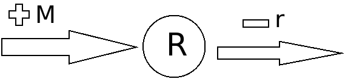

```{r setup, include=FALSE}
knitr::opts_chunk$set(echo = TRUE)
```

# Introductie

mRNA levels in a cell change dynamically in accordance with 3 models.

a. system is at the steady state.
b. number of mRNA is increasing over time.
c. number of mRNA is decreasing over time. 

## Goal.

we will attempt to make these models using the deSolve package.

## Theory.

the change of mRNA can be modelled using this biological model based upon. [\cite{model}](https://arep.med.harvard.edu/pdf/Chen99.pdf).



when we turn this biological model into a mathematical equation we get:

> dR/dt = -rR + m

R is the number of transcripts.

r is the rate of decay of existing transcripts.

m is the number of new transcripts produced per second.

mRNA or messenger RNA is used in cells to begin the translation to polypeptides. To achieve this the mRNA is transcribed from DNA. In our model this is the inflow of mRNA. After serving its purpose mRNA will decay,in our model this is our outflow of total mRNA.

#  Methods.
## The software model.

DeSolve and this formula: ```dr <- m - r * (y + m) ``` will build out out a model using the code below.
```{r, model}
library(deSolve)

# parameters
parameters <- c(m = 0, r = 0)
parameters_up <- c(m = 13, r = 0.1)
parameters_down <- c(m = 9, r = 0.1)

# model
volume <- function(t,y,parms){
  with(as.list(c(parms)),{
         dR <- m - r * (y+m)
         return(list(c(dR)))
  })}

#initial state
state <- c(Volume = 100)

#define time sequence you want to run the model
times <- seq(0, 100,  by = 1)

# run simulation using continuous approach
out  <- ode(times = times, y = state, parms = parameters, func = volume, method = "euler")
out_up <- ode(times = times, y = state, parms = parameters_up, func = volume, method = "euler")
out_down <- ode(times = times, y = state, parms = parameters_down, func = volume, method = "euler")
```


## Model configuration.
The following table has the values used in the model, 100 is used as the initial value, it represents 100% of starting value.
New transcripts is the gain of transcripts, these values are fictitious values.
Decay ratio is the loss of total transcript 0.1 is a 10% loss, these values are fictitious values.

Model | New Transcripts | Decay Ratio
------|-----------------|-------------
a.    | 0               | 0
b.    | 13              | 0.1
c.    | 9               | 0.1


# Results.
The model results in the following plot.
```{r} 
plot(out, out_up, out_down, col = c('red','green', 'blue'), lty = 1,
     xlab = 'Timepoints', ylab = 'Number of mRNA Transcripts', main = 'Amount of mRNA transcripts over time',
     ylim = c(55,145))
legend(72, 147, legend = c('Steady state', 'Increasing', 'Decreasing'), col = c('red', 'green', 'blue'), lty = 1, lwd = 2)
```

The figure above displays that the decay and the increase/decrease will eventually even out.

# Conclusion and discusion.
## Discusion.
The curves flattens out after a certain amount of time, this was an expected result. Since after a certain amount of time, the constant addition of transcripts and the fixed decay rate would become the same number.

## General conclusion and perspective.
The goal was to use deSolve to make models based upon the steady state and an increase/decrease of mRNA over time. The model we produced reached our goal aptly and is able to be used in further research, or to be updated in compliance with future research.

# References.
\begin{thebibliography}{9}

\bibitem{model}
TING CHEN, HONGYU L. HE, GEORGE M. CHURCH \textit{modeling gene expression with differential equations} 4, 1999, https://arep.med.harvard.edu/pdf/Chen99.pdf.

\end{thebibliography}
