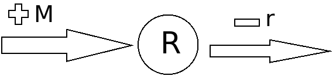

```{r setup, include=FALSE}
knitr::opts_chunk$set(echo = TRUE)
```


# 1.0 opdracht
In deze opdracht gaan we de mRNA dynamic programmeren. We gebruiken hiervoor het model

> dR/dt = -rR + m

R is the number of transcripts
r is the rate of decay of existing transcripts
m is the number of new transcripts produced per second
In dit geval kunnen we fictieve waarden gebruiken voor R, r en m.

Beantwoord de volgende vragen:

1. Welke parameters moet je programmeren?
```
parameters <- c(new_transcripts, decay_ratio)
```

2. Zoek bronnen op internet die uitleggen waar de formule dR/dt = -rR + m vandaan komt.

3. Teken het biologisch model en leg de vertaling naar de formule uit.



4. Wat is de return waarde van de model functie in R? Waarom return je die en niet R zelf?
> we are looking for dR not R


