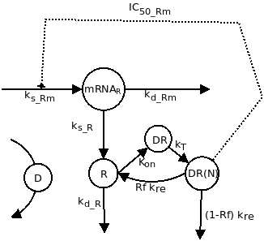

```{r setup, include=FALSE}
knitr::opts_chunk$set(echo = TRUE)
library(deSolve)
```

# Doel.

het valideren van het model uit voorgaande onderzoeken en dit model te gebruiken om te simuleren met andere parameters.

# Model validatie.

een belangrijke stap in het wetenschappelijke proces is het valideren van theorie/resultaten met de werkelijkheid. Dit gaan wij doen door de resultaten van het model te vergelijken met resultaten van experimenten.

## Vergelijking met experimenten.

In het experiment (verstreken door F.Feenstra) waren ratten MPL toegediend over een periode van 7 dagen op 2 verschillende dosissen. En op verschillende tijdspunten waren metingen gedaan naar het niveau van: vrije receptoren, mRNA en MPL concentratie. (deze data is terug te vinden in de data folder van de repository.)

```{r data, include=FALSE}
data <- read.csv("../data/MPL.csv", na.strings = "NA")
median_dose_01  <- median(data$MPL_conc[data$dose==0.1], na.rm = T)
median_dose_01p <- round((median_dose_01*1000)/374.471, digits = 3)
median_dose_03  <- median(data$MPL_conc[data$dose==0.3], na.rm = T)
median_dose_03p <- round((median_dose_03*1000)/374.471, digits = 3)
```

De data van het experiment wijst dat de mediaan MPL dosis van een dosis waarde van 0.1 `r median_dose_01` ng/ml is, en de mediaan van dosis waarde 0.3 is `r median_dose_03` ng/ml. De mediaan word gebruikt omdat deze minder vatbaar is voor meetfouten dan het gemiddelde. Omgerekend heeft de dosis waarde van 0.1 een mediaan van `r median_dose_01p` nmol/L. En voor dosis waarde 0.3 is het `r median_dose_03p` nmol/L.

```{r model, include=FALSE}
# Parameters
parameters <- c(ks_Rm = 2.90, # fmol/g liver/h
                IC50_Rm = 26.2, # fmol/mg protein
                kon = 0.00329, # L/nmol/h
                kT = 0.63, # 1/h
                kre = 0.57, # 1/h
                Rf = 0.49,
                kd_R = 0.0572, # 1/h
                kd_Rm = 0.612,
                ks_R = 3.22,
                D = median_dose_01p) # nmol/L

# Initial state
state <- c(Rmo = 4.74, # fmol/g liver
           Ro = 267, # fmol/mg protein
           DR = 0, # fmol/ mg protein
           DRN = 0) # fmol/mg protein
# Model
GR <- function(t, y, parms){
  with(as.list(c(parms)),{
    dmRNAR <- ks_Rm * (1 - y[4]/(IC50_Rm + y[4])) - kd_Rm * y[1]
    dR <- ks_R * y[1] + Rf * kre * y[4] - kon * D * y[2] - kd_R * y[2]
    dDR <- kon * D * y[2] - kT * y[3]
    dDRN <- kT * y[3] - kre * y[4] 
    return(list(c(dmRNAR, dR, dDR, dDRN)))
  })}
# Timeframe
times <- seq(0, 168, by = 1)
# Run model
out_dose_01 <- ode(y = state, times = times, parms = parameters, func = GR, method = "euler")
parameters$D <- median_dose_03p 
out_dose_03 <- ode(y = state, times = times, parms = parameters, func = GR, method = "euler")
```

\newpage

# Methode.

Om het model te kunnen valideren gebruiken wij het eerder gebruikte model gebaseerd op dit onderstaande biologische model.

{width="220"}

## initiale waarden.

| Symbool | Waarde             |
|---------|--------------------|
| mRNA~R~ | 4.74(fmol/g lever) |
| R       | 267(fmol/mg eiwit) |
| DR      | 0(fmol/mg eiwit)   |
| DR(N)   | 0(fmol/mg eiwit)   |

: Initiale waarden

| Symbool   | Waarde                                                    |
|-----------|-----------------------------------------------------------|
| k~s_Rm~   | 2.90(fmol/g lever/u)                                      |
| IC~50_Rm~ | 26.2(fmol/mg eiwit)                                       |
| k~on~     | 0.00329(L/nmol/u)                                         |
| k~T~      | 0.63(u^-1^)                                               |
| k~re~     | 0.57(u^-1^)                                               |
| Rf        | 0.49(49%)                                                 |
| k~d_R~    | 0.0572(u^-1^)                                             |
| k~d_Rm~   | 0.612(u^-1^)                                              |
| k~s_r~    | 3.22(u^-1^)                                               |
| D         | `r median_dose_01p`(nmol/L) / `r median_dose_03p`(nmol/L) |

: Parameters

# Resultaten.

```{r median data, include=FALSE}
medians <- aggregate(data[,c("MPL_conc", "mRNA", "Free_receptor")], list(data$dose, data$time), median, na.rm = T)
names(medians)[1:2] <- c("dose", "time")
```

Na het laten lopen van het model op de aangepaste D waarde zijn de onderstaande grafieken gegenereerd met de waarden uit het experiment in het rood.

```{r echo=FALSE}
par(mfrow=c(2,2))
out_dose_01 <- as.data.frame(out_dose_01)

#plot 1
plot(out_dose_01$Rmo, ylim = c(0, 5), type = "l",
     main = "mRNA bij dosis 0.1", xlab = "Tijd in uuren", ylab = "mRNA in fmol/g lever")
lines(x = medians$time[medians$dose==0.1], y = medians$mRNA[medians$dose==0.1], lty = "dotted", col = "red", type = "b")
legend("topright", c("model", "experiment"), lty = c("solid", "dotted"), col = c("black", "red"), bty = "n", ncol = 2)

#plot 2
plot(out_dose_01$Ro, type = "l", ylim = c(0, 300),
     main = "Vrije receptoren bij dosis 0.1", xlab = "Tijd in uuren", ylab = "receptoren in fmol/mg eiwit")
lines(x = medians$time[medians$dose==0.1], y = medians$Free_receptor[medians$dose==0.1], lty = "dotted", col = "red", type = "b")
legend("topright", c("model", "experiment"), lty = c("solid", "dotted"), col = c("black", "red"), bty = "n", ncol = 2)

out_dose_03 <- as.data.frame(out_dose_03)

#plot 3
plot(out_dose_03$Rmo, ylim = c(0, 5), type = "l",
     main = "mRNA bij dosis 0.3", xlab = "Tijd in uren", ylab = "mRNA in fmol/g lever")
lines(x = medians$time[medians$dose==0.1], y = medians$mRNA[medians$dose==0.1], lty = "dotted", col = "red", type = "b")
legend("topright", c("model", "experiment"), lty = c("solid", "dotted"), col = c("black", "red"), bty = "n", ncol = 2)

#plot4
plot(out_dose_03$Ro, type = "l", ylim = c(0,300),
     main = "Vrije receptoren bij dosis 0.3", xlab = "Tijd in uren", ylab = "receptoren in fmol/mg eiwit")
lines(x = medians$time[medians$dose==0.1], y = medians$Free_receptor[medians$dose==0.1], lty = "dotted", col = "red", type = "b")
legend("topright", c("model", "experiment"), lty = c("solid", "dotted"), col = c("black", "red"), bty = "n", ncol = 2)
```

zoals te zien is in deze grafieken zijn de waarden uit het experiment en de waarden uit het model zeer afwijkend van elkaar. Maar mogelijk kunnen de waarden uit het model wel valide zijn ten opzichte van het experiment. Want de rode lijn is het mediaan en meestal liggen de waarden uit het model tussen data punten uit het experiment, waardoor het misschien mogelijk is dat de waarde uit het model tussen de kwartielen liggen en het wel statistisch gezien valide is.

# Conclusie.

Op basis van de data uit de experimenten is de data gegenereerd door het model binnen de interkwartielafstand waardes uit het experiment. Hieruit is te concluderen dat het model valide is.

\newpage

# Appendix.

## Code.

```{r appendix, eval=FALSE}
#Read data
data <- read.csv("../data/MPL.csv", na.strings = "NA")
median_dose_01  <- median(data$MPL_conc[data$dose==0.1], na.rm = T)
median_dose_01p <- round((median_dose_01*1000)/374.471, digits = 3)
median_dose_03  <- median(data$MPL_conc[data$dose==0.3], na.rm = T)
median_dose_03p <- round((median_dose_03*1000)/374.471, digits = 3)

# Model
# Parameters
parameters <- c(ks_Rm = 2.90, # fmol/g liver/h
                IC50_Rm = 26.2, # fmol/mg protein
                kon = 0.00329, # L/nmol/h
                kT = 0.63, # 1/h
                kre = 0.57, # 1/h
                Rf = 0.49,
                kd_R = 0.0572, # 1/h
                kd_Rm = 0.612,
                ks_R = 3.22,
                D = median_dose_01p) # nmol/L

# Initial state
state <- c(Rmo = 4.74, # fmol/g liver
           Ro = 267, # fmol/mg protein
           DR = 0, # fmol/ mg protein
           DRN = 0) # fmol/mg protein
# Model
GR <- function(t, y, parms){
  with(as.list(c(parms)),{
    dmRNAR <- ks_Rm * (1 - y[4]/(IC50_Rm + y[4])) - kd_Rm * y[1]
    dR <- ks_R * y[1] + Rf * kre * y[4] - kon * D * y[2] - kd_R * y[2]
    dDR <- kon * D * y[2] - kT * y[3]
    dDRN <- kT * y[3] - kre * y[4] 
    return(list(c(dmRNAR, dR, dDR, dDRN)))
  })}
# Timeframe
times <- seq(0, 168, by = 1)
# Run model
out_dose_01 <- ode(y = state, times = times, parms = parameters, func = GR, method = "euler")
parameters$D <- median_dose_03p 
out_dose_03 <- ode(y = state, times = times, parms = parameters, func = GR, method = "euler")

#median
medians <- aggregate(data[,c("MPL_conc", "mRNA", "Free_receptor")], list(data$dose, data$time), median, na.rm = T)
names(medians)[1:2] <- c("dose", "time")

# Plots
par(mfrow=c(2,2))
out_dose_01 <- as.data.frame(out_dose_01)

#plot 1
plot(out_dose_01$Rmo, ylim = c(0, 5), type = "l",
     main = "mRNA bij dosis 0.1", xlab = "Tijd in uuren", ylab = "mRNA in fmol/g lever")
lines(x = medians$time[medians$dose==0.1], y = medians$mRNA[medians$dose==0.1], lty = "dotted", col = "red", type = "b")
legend("topright", c("model", "experiment"), lty = c("solid", "dotted"), col = c("black", "red"), bty = "n", ncol = 2)

#plot 2
plot(out_dose_01$Ro, type = "l", ylim = c(0, 300),
     main = "Vrije receptoren bij dosis 0.1", xlab = "Tijd in uuren", ylab = "receptoren in fmol/mg eiwit")
lines(x = medians$time[medians$dose==0.1], y = medians$Free_receptor[medians$dose==0.1], lty = "dotted", col = "red", type = "b")
legend("topright", c("model", "experiment"), lty = c("solid", "dotted"), col = c("black", "red"), bty = "n", ncol = 2)

out_dose_03 <- as.data.frame(out_dose_03)

#plot 3
plot(out_dose_03$Rmo, ylim = c(0, 5), type = "l",
     main = "mRNA bij dosis 0.3", xlab = "Tijd in uren", ylab = "mRNA in fmol/g lever")
lines(x = medians$time[medians$dose==0.1], y = medians$mRNA[medians$dose==0.1], lty = "dotted", col = "red", type = "b")
legend("topright", c("model", "experiment"), lty = c("solid", "dotted"), col = c("black", "red"), bty = "n", ncol = 2)

#plot4
plot(out_dose_03$Ro, type = "l", ylim = c(0,300),
     main = "Vrije receptoren bij dosis 0.3", xlab = "Tijd in uren", ylab = "receptoren in fmol/mg eiwit")
lines(x = medians$time[medians$dose==0.1], y = medians$Free_receptor[medians$dose==0.1], lty = "dotted", col = "red", type = "b")
legend("topright", c("model", "experiment"), lty = c("solid", "dotted"), col = c("black", "red"), bty = "n", ncol = 2)
```
