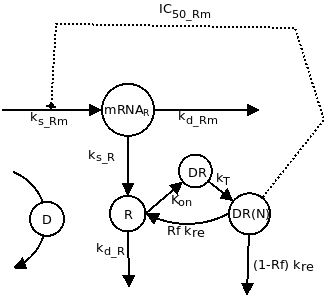

```{r setup, include=FALSE}
knitr::opts_chunk$set(echo = TRUE)
library(deSolve)
```

# Doel.

het valideren van het model uit voorgaande onderzoeken en dit model te gebruiken om te simuleren met andere parameters.

# Model validatie.

een belangrijke stap in het wetenschappelijke proces is het valideren van theorie/resultaten met de werkelijkheid. Dit gaan wij doen door de resultaten van het model te vergelijken met resultaten van experimenten.

## Vergelijking met experimenten.

In het experiment (verstreken door F.Feenstra) waren ratten MPL toegediend over een periode van 7 dagen op 2 verschillende dosissen. En op verschillende tijdspunten waren metingen gedaan naar het niveau van: vrije receptoren, mRNA en MPL concentratie. (deze data is terug te vinden in de data folder van de repository.)

```{r data, include=FALSE}
data <- read.csv("../data/MPL.csv", na.strings = "NA")
median_dose_01  <- median(data$MPL_conc[data$dose==0.1], na.rm = T)
median_dose_01p <- round((median_dose_01*1000)/374.471, digits = 3)
median_dose_03  <- median(data$MPL_conc[data$dose==0.3], na.rm = T)
median_dose_03p <- round((median_dose_03*1000)/374.471, digits = 3)
```

De data van het experiment wijst dat de mediaan MPL dosis van een dosis waarde van 0.1 `r median_dose_01` ng/ml is, en de mediaan van dosis waarde 0.3 is `r median_dose_03` ng/ml. De mediaan word gebruikt omdat deze minder vatbaar is voor meetfouten dan het gemiddelde. Omgerekend heeft de dosis waarde van 0.1 een mediaan van `r median_dose_01p` nmol/L. En voor dosis waarde 0.3 is het `r median_dose_03p` nmol/L.

```{r model, include=FALSE}
# Parameters
parameters <- c(ks_Rm = 2.90, # fmol/g liver/h
                IC50_Rm = 26.2, # fmol/mg protein
                kon = 0.00329, # L/nmol/h
                kT = 0.63, # 1/h
                kre = 0.57, # 1/h
                Rf = 0.49,
                kd_R = 0.0572, # 1/h
                kd_Rm = 0.612,
                ks_R = 3.22,
                D = median_dose_01p) # nmol/L
# Initial state
state <- c(Rmo = 4.74, # fmol/g liver
           Ro = 267, # fmol/mg protein
           DR = 0, # fmol/ mg protein
           DRN = 0) # fmol/mg protein
# Model
GR <- function(t, y, parms){
  with(as.list(c(parms)),{
    dmRNAR <- ks_Rm * (1 - y[4]/(IC50_Rm + y[4])) - kd_Rm * y[1]
    dR <- ks_R * y[1] + Rf * kre * y[4] - kon * D * y[2] - kd_R * y[2]
    dDR <- kon * D * y[2] - kT * y[3]
    dDRN <- kT * y[3] - kre * y[4] 
    return(list(c(dmRNAR, dR, dDR, dDRN)))
  })}
# Timeframe
times <- seq(0, 168, by = 1)
# Run model
out_dose_01 <- ode(y = state, times = times, parms = parameters, func = GR, method = "euler")
parameters$D <- median_dose_03p 
out_dose_03 <- ode(y = state, times = times, parms = parameters, func = GR, method = "euler")
```

\newpage

# Methode.

Om het model te kunnen valideren gebruiken wij het eerder gebruikte model gebaseerd op dit onderstaande biologische model.

{width="220"}

## initiale waarden.

| Symbool | Waarde             |
|---------|--------------------|
| mRNA~R~ | 4.74(fmol/g lever) |
| R       | 267(fmol/mg eiwit) |
| DR      | 0(fmol/mg eiwit)   |
| DR(N)   | 0(fmol/mg eiwit)   |

: Initiale waarden

| Symbool   | Waarde                                                    |
|-----------|-----------------------------------------------------------|
| k~s_Rm~   | 2.90(fmol/g lever/u)                                      |
| IC~50_Rm~ | 26.2(fmol/mg eiwit)                                       |
| k~on~     | 0.00329(L/nmol/u)                                         |
| k~T~      | 0.63(u^-1^)                                               |
| k~re~     | 0.57(u^-1^)                                               |
| Rf        | 0.49(49%)                                                 |
| k~d_R~    | 0.0572(u^-1^)                                             |
| k~d_Rm~   | 0.612(u^-1^)                                              |
| k~s_r~    | 3.22(u^-1^)                                               |
| D         | `r median_dose_01p`(nmol/L) / `r median_dose_03p`(nmol/L) |

: Parameters

# Resultaten.

```{r median data, include=FALSE}
medians <- aggregate(data[,c("MPL_conc", "mRNA", "Free_receptor")], list(data$dose, data$time), median, na.rm = T)
names(medians)[1:2] <- c("dose", "time")
```

Na het laten lopen van het model op de aangepaste D waarde zijn de onderstaande grafieken gegenereerd met de waarden uit het experiment in het rood.

```{r echo=FALSE}
par(mfrow=c(2,2))
out_dose_01 <- as.data.frame(out_dose_01)
#plot 1
plot(out_dose_01$Rmo, ylim = c(0, 5), type = "l",
     main = "mRNA bij dosis 0.1", xlab = "Tijd in uuren", ylab = "mRNA in fmol/g lever")
lines(x = medians$time[medians$dose==0.1], y = medians$mRNA[medians$dose==0.1], lty = "dotted", col = "red", type = "b")
legend("topright", c("model", "experiment"), lty = c("solid", "dotted"), col = c("black", "red"), bty = "n", ncol = 2)
#plot 2
plot(out_dose_01$Ro, type = "l", ylim = c(0, 300),
     main = "Vrije receptoren bij dosis 0.1", xlab = "Tijd in uuren", ylab = "receptoren in fmol/mg eiwit")
lines(x = medians$time[medians$dose==0.1], y = medians$Free_receptor[medians$dose==0.1], lty = "dotted", col = "red", type = "b")
legend("topright", c("model", "experiment"), lty = c("solid", "dotted"), col = c("black", "red"), bty = "n", ncol = 2)
out_dose_03 <- as.data.frame(out_dose_03)
#plot 3
plot(out_dose_03$Rmo, ylim = c(0, 5), type = "l",
     main = "mRNA bij dosis 0.3", xlab = "Tijd in uren", ylab = "mRNA in fmol/g lever")
lines(x = medians$time[medians$dose==0.1], y = medians$mRNA[medians$dose==0.1], lty = "dotted", col = "red", type = "b")
legend("topright", c("model", "experiment"), lty = c("solid", "dotted"), col = c("black", "red"), bty = "n", ncol = 2)
#plot4
plot(out_dose_03$Ro, type = "l", ylim = c(0,300),
     main = "Vrije receptoren bij dosis 0.3", xlab = "Tijd in uren", ylab = "receptoren in fmol/mg eiwit")
lines(x = medians$time[medians$dose==0.1], y = medians$Free_receptor[medians$dose==0.1], lty = "dotted", col = "red", type = "b")
legend("topright", c("model", "experiment"), lty = c("solid", "dotted"), col = c("black", "red"), bty = "n", ncol = 2)
```

zoals te zien is in deze grafieken zijn de waarden uit het experiment en de waarden uit het model zeer afwijkend van elkaar. Maar mogelijk kunnen de waarden uit het model wel valide zijn ten opzichte van het experiment. Want de rode lijn is het mediaan en meestal liggen de waarden uit het model tussen data punten uit het experiment, waardoor het misschien mogelijk is dat de waarde uit het model tussen de kwartielen liggen en het wel statistisch gezien valide is.

# Conclusie.

Op basis van de data uit de experimenten is de data gegenereerd door het model binnen de interkwartielafstand waardes uit het experiment. Hieruit is te concluderen dat het model valide is.

\newpage


# Questions:

## 1 
Door de auto regulatie uit te schakelen, kan er ongeremt synthese plaats vinden van het receptor mRNA. in de formule [ks_Rm * (1 - DRN/(IC50_Rm + DRN)) - kd_Rm * Rmo], wordt het deel van de auto regulatie door de IC50_rm verwijderd. dit geeft de volgende nieuwe formule Ks_rm - kd_rm * Rmo. door deze verandering door te voeren zien de plots er als volgt uit:

```{r echo = F}
GR <- function(t, state, parms){
  with(as.list(c(state, parms)),{
    dmRNAR <- ks_Rm - kd_Rm * Rmo
    dR <- ks_R * Rmo + Rf * kre * DRN - kon * D * Ro - kd_R * Ro
    dDR <- kon * D * Ro - kT * DR
    dDRN <- kT * DR - kre * DRN
    return(list(c(dmRNAR, dR, dDR, dDRN)))
  })}

out <- ode(y = state, times = times, parms = parameters, func = GR, method = "euler")

# Plot
plot(out, main = c("Level of receptor mRNA", "Level of free receptors",
                   "Densety of MPL-receptor complex", "Number of MPL-complexes\nin the nucleous"),
     xlab = "time in hours",
     ylab = c("fmol/g liver", "fmol/mg protein", "fmol/mg protein", "fmol/mg protein"))

```
Doordat de autoregulatie nu uitgeschakelt is, trekt het niveau van het receptor mRNA naar 0 toe. hierdoor stagneert de aanmaakt van nieuwe MRA.

## 2
Na een x aantal uren bereikt de receptor mRNA en vrije receptor concentratie een evenwicht, er komt niet meer mRNA of vrije receptor bij en er wordt niks afgebroken. Nu wordt er gekeken, wat gebeurt er als de toevoeging van het medicijn stopt. Hiervoor wordt een tweede tijdsequentie toegevoegd, waarin de D (concentratie van MPL in nmol/L) op 0 wordt gezet. Deze nieuwe tijdssequentie wordt aan de eerste tijdssequentie geplakt. 

```{r echo = F}
GR <- function(t, state, parms){
  with(as.list(c(state, parms)),{
    dmRNAR <- ks_Rm * (1 - DRN/(IC50_Rm + DRN)) - kd_Rm * Rmo
    dR <- ks_R * Rmo + Rf * kre * DRN - kon * D * Ro - kd_R * Ro
    dDR <- kon * D * Ro - kT * DR
    dDRN <- kT * DR - kre * DRN
    return(list(c(dmRNAR, dR, dDR, dDRN)))
  })}

# Observation time series (using function seq)
Times  <-seq(0,24*2,by=1)
Times2 <- seq(0,24*3,by=1)

para_after <- replace(parameters, 10, 0)

out1 <- ode(y = state, times = Times, parms = parameters, func = GR, method = "euler")
out2 <- ode(y=out1[length(Times),2:5], times=Times2, parms= para_after, func = GR, method = "euler")

out2[,1] <- out2[,1]+Times[length(Times)]

out_n <- rbind(out1,out2)

# Convert output to dataframe for easy post-processing using $ notation
out_r<-as.data.frame(out_n)

# Make plot of concentration of receptor mRNa and free receptor density
par(mfrow=c(1,2))
plot(out_r$time,out_r$Rm,ylim = c(1,5), xlab="Time",ylab="receptor mRNA",type="l",lwd=2)
plot(out_r$time,out_r$Ro, ylim = c(0,500), xlab="Time",ylab="free receptor density",type="l",lwd=2)
```

Er is duidelijk te zien dat het stoppen van de toevoeging van medicijn een sterk effect heeft. Zowel de concentratie receptor mRNA als vrije receptoren stijgt sterkt na het ontbreken van het medicijn. Door dat er geen medicijn aanwezig is worden de mRNA's niet meer getransleerd en worden de vrije receptoren ook niet meer verbruikt.

## 3
Verschillende corticosteroïden laten verschillende stijgingen en dalingen zien van K~on (snelheidsconstante voor de vorming van MPL-receptor (nmol/L/u)) en K~re (snelheidsconstante voor het herstel van MPL-receptor complexen uit de celkern per uur).Er wordt gekeken wat het effect is op de receptor en mRNA dynamica. Er wordt bij K~on en K~re gekeken naar een toename van 2 en 5, en een vermindering van 2 en 5 keer. 

```{r echo = F}
# Model
GR <- function(t, state, parms){
  with(as.list(c(state, parms)),{
    dmRNAR <- ks_Rm * (1 - DRN/(IC50_Rm + DRN)) - kd_Rm * Rmo
    dR <- ks_R * Rmo + Rf * kre * DRN - kon * D * Ro - kd_R * Ro
    dDR <- kon * D * Ro - kT * DR
    dDRN <- kT * DR - kre * DRN
    return(list(c(dmRNAR, dR, dDR, dDRN)))
  })}

# Initial state
state <- c(Rmo = 4.74, # fmol/g liver
           Ro = 267, # fmol/mg protein
           DR = 0, # fmol/ mg protein
           DRN = 0) # fmol/mg protein

# Observation time series (using function seq)
ObservationTimes<-seq(0,24*2,by=1)

factors <- c(1/5,1/2,1,2,5)

# Load model parameters
MyParms_kon<-cbind(
  ks_Rm=rep(2.9,times=length(factors)),
  IC50_Rm=rep(26.2,times=length(factors)),
  kon=0.00329*factors,
  kT=rep(0.63,times=length(factors)),
  kre=rep(0.57,times=length(factors)),
  Rf=rep(0.49,times=length(factors)),
  kd_R=rep(0.0572,times=length(factors)),
  kd_Rm=rep(0.612,times=length(factors)),
  ks_R=rep(3.22,times=length(factors)),
  D=rep(20*1000/374.471,times=length(factors))
)

MyParms_kre<-cbind(
  ks_Rm=rep(2.9,times=length(factors)),
  IC50_Rm=rep(26.2,times=length(factors)),
  kon=rep(0.00329,times=length(factors)),
  kT=rep(0.63,times=length(factors)),
  kre=0.57*factors,
  Rf=rep(0.49,times=length(factors)),
  kd_R=rep(0.0572,times=length(factors)),
  kd_Rm=rep(0.612,times=length(factors)),
  ks_R=rep(3.22,times=length(factors)),
  D=rep(20*1000/374.471,times=length(factors))
  )

# simulations for different kon

for (i in 1:length(factors)){
# call lsoda and store result in out
  out <- ode(
    y=state, 
    times=ObservationTimes,   							
    func=GR, 
    parms=MyParms_kon[i,]
  )  
  # Convert output to dataframe for easy post-processing using $ notation
  out<-as.data.frame(out)
  out$kon <- MyParms_kon[i,c("kon")]
  
  if (i>1)
   {  
       simset_kon<-rbind(simset_kon,out)
   }
   else
   {
       simset_kon<-out
   }
}


# simulations for different kre

for (i in 1:length(factors)){
# call lsoda and store result in out
  out <- ode(
     y=state, 
     times=ObservationTimes,     						
    func=GR, 
    parms=MyParms_kre[i,]
  )  
  # Convert output to dataframe for easy post-processing using $ notation
  out<-as.data.frame(out)
  out$kre <- MyParms_kre[i,c("kre")]
  
  if (i>1)
   {  
       simset_kre<-rbind(simset_kre,out)
   }
   else
   {
       simset_kre<-out
   }        
}


# Make plots of concentration of receptor mRNa and free receptor density
par(mfrow=c(2,2))
  plot(simset_kon$time[simset_kon$kon==MyParms_kon[1,c("kon")]],simset_kon$Rm[simset_kon$kon==MyParms_kon[1,c("kon")]],ylim = c(0,5), xlab="Time",ylab="receptor mRNA", main = 'Kon', type="l",lwd=2, col="Red")
  lines(simset_kon$time[simset_kon$kon==MyParms_kon[2,c("kon")]],simset_kon$Rm[simset_kon$kon==MyParms_kon[2,c("kon")]],ylim = c(0,5), type="l",lwd=2, col="lightblue")
  lines(simset_kon$time[simset_kon$kon==MyParms_kon[3,c("kon")]],simset_kon$Rm[simset_kon$kon==MyParms_kon[3,c("kon")]],ylim = c(0,5), type="l",lwd=2, col="black")
  lines(simset_kon$time[simset_kon$kon==MyParms_kon[4,c("kon")]],simset_kon$Rm[simset_kon$kon==MyParms_kon[4,c("kon")]],ylim = c(0,5), type="l",lwd=2, col="orange")
  lines(simset_kon$time[simset_kon$kon==MyParms_kon[5,c("kon")]],simset_kon$Rm[simset_kon$kon==MyParms_kon[5,c("kon")]],ylim = c(0,5), type="l",lwd=2, col="green")

  plot(simset_kon$time[simset_kon$kon==MyParms_kon[1,c("kon")]],simset_kon$Ro[simset_kon$kon==MyParms_kon[1,c("kon")]], ylim = c(0,300), xlab="Time",ylab="free receptor density",main = 'Kon',type="l",lwd=2, col="red")
  lines(simset_kon$time[simset_kon$kon==MyParms_kon[2,c("kon")]],simset_kon$Ro[simset_kon$kon==MyParms_kon[2,c("kon")]], ylim = c(0,300), type="l",lwd=2, col="lightblue")
  lines(simset_kon$time[simset_kon$kon==MyParms_kon[3,c("kon")]],simset_kon$Ro[simset_kon$kon==MyParms_kon[3,c("kon")]], ylim = c(0,300), type="l",lwd=2, col="black")
  lines(simset_kon$time[simset_kon$kon==MyParms_kon[4,c("kon")]],simset_kon$Ro[simset_kon$kon==MyParms_kon[4,c("kon")]], ylim = c(0,300), type="l",lwd=2, col="orange")
  lines(simset_kon$time[simset_kon$kon==MyParms_kon[5,c("kon")]],simset_kon$Ro[simset_kon$kon==MyParms_kon[5,c("kon")]], ylim = c(0,300), type="l",lwd=2, col="green")

  plot(simset_kon$time[simset_kon$kon==MyParms_kon[1,c("kon")]],simset_kon$DR[simset_kon$kon==MyParms_kon[1,c("kon")]], ylim = c(0,130), xlab="Time",ylab="drug-receptor complex",main = 'Kon',type="l",lwd=2, col="red")
  lines(simset_kon$time[simset_kon$kon==MyParms_kon[2,c("kon")]],simset_kon$DR[simset_kon$kon==MyParms_kon[2,c("kon")]], ylim = c(0,130), type="l",lwd=2, col="lightblue")
  lines(simset_kon$time[simset_kon$kon==MyParms_kon[3,c("kon")]],simset_kon$DR[simset_kon$kon==MyParms_kon[3,c("kon")]], ylim = c(0,130), type="l",lwd=2, col="black")
  lines(simset_kon$time[simset_kon$kon==MyParms_kon[4,c("kon")]],simset_kon$DR[simset_kon$kon==MyParms_kon[4,c("kon")]], ylim = c(0,130), type="l",lwd=2, col="orange")
  lines(simset_kon$time[simset_kon$kon==MyParms_kon[5,c("kon")]],simset_kon$DR[simset_kon$kon==MyParms_kon[5,c("kon")]], ylim = c(0,130), type="l",lwd=2, col="green")

  plot(simset_kon$time[simset_kon$kon==MyParms_kon[1,c("kon")]],simset_kon$DRN[simset_kon$kon==MyParms_kon[1,c("kon")]], ylim = c(0,100), xlab="Time",ylab="activated drug-receptor complex",main = 'Kon',type="l",lwd=2, col="red")
  lines(simset_kon$time[simset_kon$kon==MyParms_kon[2,c("kon")]],simset_kon$DRN[simset_kon$kon==MyParms_kon[2,c("kon")]], ylim = c(0,100), type="l",lwd=2, col="lightblue")
  lines(simset_kon$time[simset_kon$kon==MyParms_kon[3,c("kon")]],simset_kon$DRN[simset_kon$kon==MyParms_kon[3,c("kon")]], ylim = c(0,100), type="l",lwd=2, col="black")
  lines(simset_kon$time[simset_kon$kon==MyParms_kon[4,c("kon")]],simset_kon$DRN[simset_kon$kon==MyParms_kon[4,c("kon")]], ylim = c(0,100), type="l",lwd=2, col="orange")
  lines(simset_kon$time[simset_kon$kon==MyParms_kon[5,c("kon")]],simset_kon$DRN[simset_kon$kon==MyParms_kon[5,c("kon")]], ylim = c(0,100), type="l",lwd=2, col="green")
  
par(fig = c(0,1,0,1), oma = c(0,0,0,0), mar = c(0,0,0,0), new = TRUE)
plot(0,0, type = 'l', bty = 'n', xaxt = 'n', yaxt = 'n')
legend(x = 'bottom', legend= c("5 fold decrease", "2 fold decrease", "normal", "2 fold increase", "5 fold increase"), col = c("red", "lightblue", "black", "orange", "green") ,
       lwd=3, cex=1, horiz = T, xpd = T, seg.len = 2, bty = 'n')

# Make plots of concentration of receptor mRNa and free receptor density
par(mfrow=c(2,2))
plot(simset_kre$time[simset_kre$kre==MyParms_kre[1,c("kre")]],simset_kre$Rm[simset_kre$kre==MyParms_kre[1,c("kre")]],ylim = c(0,5), xlab="Time",ylab="receptor mRNA",main = 'Kre',type="l",lwd=2, col="red")
  lines(simset_kre$time[simset_kre$kre==MyParms_kre[2,c("kre")]],simset_kre$Rm[simset_kre$kre==MyParms_kre[2,c("kre")]],ylim = c(0,5), type="l",lwd=2, col="lightblue")
  lines(simset_kre$time[simset_kre$kre==MyParms_kre[3,c("kre")]],simset_kre$Rm[simset_kre$kre==MyParms_kre[3,c("kre")]],ylim = c(0,5), type="l",lwd=2, col="black")
  lines(simset_kre$time[simset_kre$kre==MyParms_kre[4,c("kre")]],simset_kre$Rm[simset_kre$kre==MyParms_kre[4,c("kre")]],ylim = c(0,5), type="l",lwd=2, col="orange")
  lines(simset_kre$time[simset_kre$kre==MyParms_kre[5,c("kre")]],simset_kre$Rm[simset_kre$kre==MyParms_kre[5,c("kre")]],ylim = c(0,5), type="l",lwd=2, col="green")

  plot(simset_kre$time[simset_kre$kre==MyParms_kre[1,c("kre")]],simset_kre$Ro[simset_kre$kre==MyParms_kre[1,c("kre")]], ylim = c(0,300), xlab="Time",ylab="free receptor density",main = 'Kre',type="l",lwd=2, col="red")
  lines(simset_kre$time[simset_kre$kre==MyParms_kre[2,c("kre")]],simset_kre$Ro[simset_kre$kre==MyParms_kre[2,c("kre")]], ylim = c(0,300), type="l",lwd=2, col="lightblue")
  lines(simset_kre$time[simset_kre$kre==MyParms_kre[3,c("kre")]],simset_kre$Ro[simset_kre$kre==MyParms_kre[3,c("kre")]], ylim = c(0,300), type="l",lwd=2, col="black")
  lines(simset_kre$time[simset_kre$kre==MyParms_kre[4,c("kre")]],simset_kre$Ro[simset_kre$kre==MyParms_kre[4,c("kre")]], ylim = c(0,300), type="l",lwd=2, col="orange")
  lines(simset_kre$time[simset_kre$kre==MyParms_kre[5,c("kre")]],simset_kre$Ro[simset_kre$kre==MyParms_kre[5,c("kre")]], ylim = c(0,300), type="l",lwd=2, col="green")

  plot(simset_kre$time[simset_kre$kre==MyParms_kre[1,c("kre")]],simset_kre$DR[simset_kre$kre==MyParms_kre[1,c("kre")]], ylim = c(0,60), xlab="Time",ylab="drug-receptor complex",main = 'Kre',type="l",lwd=2, col="red")
  lines(simset_kre$time[simset_kre$kre==MyParms_kre[2,c("kre")]],simset_kre$DR[simset_kre$kre==MyParms_kre[2,c("kre")]], ylim = c(0,60), type="l",lwd=2, col="lightblue")
  lines(simset_kre$time[simset_kre$kre==MyParms_kre[3,c("kre")]],simset_kre$DR[simset_kre$kre==MyParms_kre[3,c("kre")]], ylim = c(0,60), type="l",lwd=2, col="black")
  lines(simset_kre$time[simset_kre$kre==MyParms_kre[4,c("kre")]],simset_kre$DR[simset_kre$kre==MyParms_kre[4,c("kre")]], ylim = c(0,60), type="l",lwd=2, col="orange")
  lines(simset_kre$time[simset_kre$kre==MyParms_kre[5,c("kre")]],simset_kre$DR[simset_kre$kre==MyParms_kre[5,c("kre")]], ylim = c(0,60), type="l",lwd=2, col="green")

  plot(simset_kre$time[simset_kre$kre==MyParms_kre[1,c("kre")]],simset_kre$DRN[simset_kre$kre==MyParms_kre[1,c("kre")]], ylim = c(0,130), xlab="Time",ylab="activated drug-receptor complex",main = 'Kre',type="l",lwd=2, col="red")
  lines(simset_kre$time[simset_kre$kre==MyParms_kre[2,c("kre")]],simset_kre$DRN[simset_kre$kre==MyParms_kre[2,c("kre")]], ylim = c(0,130), type="l",lwd=2, col="lightblue")
  lines(simset_kre$time[simset_kre$kre==MyParms_kre[3,c("kre")]],simset_kre$DRN[simset_kre$kre==MyParms_kre[3,c("kre")]], ylim = c(0,130), type="l",lwd=2, col="black")
  lines(simset_kre$time[simset_kre$kre==MyParms_kre[4,c("kre")]],simset_kre$DRN[simset_kre$kre==MyParms_kre[4,c("kre")]], ylim = c(0,130), type="l",lwd=2, col="orange")
  lines(simset_kre$time[simset_kre$kre==MyParms_kre[5,c("kre")]],simset_kre$DRN[simset_kre$kre==MyParms_kre[5,c("kre")]], ylim = c(0,130), type="l",lwd=2, col="green")
  
par(fig = c(0,1,0,1), oma = c(0,0,0,0), mar = c(0,0,0,0), new = TRUE)
plot(0,0, type = 'l', bty = 'n', xaxt = 'n', yaxt = 'n')
legend(x = 'bottom', legend= c("5 fold decrease", "2 fold decrease", "normal", "2 fold increase", "5 fold increase"), col = c("red", "lightblue", "black", "orange", "green") ,
       lwd=3, cex=1, horiz = T, xpd = T, seg.len = 2, bty = 'n')  
```
Uit de grafieken is op te maken dat een vermeerdering of vermindering van de concentratie K~on of K~re een duidelijk effect heeft. Al kan worden geconcludeerd dat de K~re verandering voor meer veranderingen zorgt dan de K~on.

## 4
wat gebeurt er als de synthese van de receptor op 0 wordt gezet? Hiervoor wordt de ks_r parameter veranderd naar 0:

```{r echo = F}
para_alt <- replace(parameters, 9, 0)

out <- ode(y = state, times = times, parms = para_alt, func = GR, method = "euler")

# Plot
plot(out, main = c("Level of receptor mRNA", "Level of free receptors",
                   "Densety of MPL-receptor complex", "Number of MPL-complexes\nin the nucleous"),
     xlab = "time in hours",
     ylab = c("fmol/g liver", "fmol/mg protein", "fmol/mg protein", "fmol/mg protein"))
```
Door de aanmaak van de receptor op 0 te zetten wordt de grafiek van het receptor mRNA het meeste aangetast. Na de daling, herstelt deze zich sterk met een stijging naar het oude niveau.

## 5
Wat is de dynamiek van het systeem wanneer de basis snelheid van de mRNA productie in verhoogd of verlaagd? De basis snelheid van de mRNA productie wordt vermenigvuldigd met de volgende factors = 1/5, 1/2, 1, 2, 5

```{r echo = F}
fifthGenerationModel <- function(t, x, parms) 
{
  Rm <- x[1]           # mRNA for the receptor
  R <- x[2]           # receptor density
  DR <- x[3]           # drug-receptor comples
  DRN <- x[4]         # nuclear activated drug-receptor complex
  
  with(as.list(parms),
  {
     dRm <- ksyn_rm*(1-DRN/(IC50 + DRN)) - kdgr_rm*Rm
     dR <- ksyn_r*Rm + rf*kre*DRN - kon*D*R - kdgr_r*R
     dDR <- kon*D*R - kt*DR
     dDRN <- kt*DR - kre*DRN
 
     # store results in res
     res<-c(dRm,dR,dDR,dDRN)
     list(res)
  })
}

# Observation time series (using function seq)
ObservationTimes<-seq(0,24*2,by=1)

factors <- c(1/5,1/2,1,2,5)
ksyn_rm=2.9*factors
kdgr_rm=ksyn_rm/4.74

# Load model parameters
MyParms_ksyn_rm<-cbind(
  ksyn_rm=ksyn_rm,
  IC50=rep(26.2,times=length(factors)),
  kon=rep(0.00329,times=length(factors)),
  kt=rep(0.63,times=length(factors)),
  kre=rep(0.57,times=length(factors)),
  rf=rep(0.49,times=length(factors)),
  kdgr_r=rep(0.0572,times=length(factors)),
  kdgr_rm=kdgr_rm,
  ksyn_r=rep(3.22,times=length(factors)),
  D=rep(20*1000/374.471,times=length(factors))   #(20/374.471)*1000
)


# simulations for different ksyn_rm

for (i in 1:length(factors)){
# call lsoda and store result in out
  out <- ode(
      y=state, 
     times=ObservationTimes,   							
    func=fifthGenerationModel, 
    parms=MyParms_ksyn_rm[i,]
  )  
  # Convert output to dataframe for easy post-processing using $ notation
  out<-as.data.frame(out)
  out$ksyn_rm <- MyParms_ksyn_rm[i,c("ksyn_rm")]
  
  if (i>1)
   {  
       simset_ksyn_rm<-rbind(simset_ksyn_rm,out)
   }
   else
   {
       simset_ksyn_rm<-out
   }
}

# Make plots of concentration of receptor mRNa and free receptor density
par(mfrow=c(2,2))
  plot(simset_ksyn_rm$time[simset_ksyn_rm$ksyn_rm==MyParms_ksyn_rm[1,c("ksyn_rm")]],simset_ksyn_rm$Rm[simset_ksyn_rm$ksyn_rm==MyParms_ksyn_rm[1,c("ksyn_rm")]],ylim = c(0,5), xlab="Time",ylab="receptor mRNA",main ="Rmo", type="l",lwd=2, col="red")
  lines(simset_ksyn_rm$time[simset_ksyn_rm$ksyn_rm==MyParms_ksyn_rm[2,c("ksyn_rm")]],simset_ksyn_rm$Rm[simset_ksyn_rm$ksyn_rm==MyParms_ksyn_rm[2,c("ksyn_rm")]],ylim = c(0,5), type="l",lwd=2, col="lightblue")
  lines(simset_ksyn_rm$time[simset_ksyn_rm$ksyn_rm==MyParms_ksyn_rm[3,c("ksyn_rm")]],simset_ksyn_rm$Rm[simset_ksyn_rm$ksyn_rm==MyParms_ksyn_rm[3,c("ksyn_rm")]],ylim = c(0,5), type="l",lwd=2, col="black")
  lines(simset_ksyn_rm$time[simset_ksyn_rm$ksyn_rm==MyParms_ksyn_rm[4,c("ksyn_rm")]],simset_ksyn_rm$Rm[simset_ksyn_rm$ksyn_rm==MyParms_ksyn_rm[4,c("ksyn_rm")]],ylim = c(0,5), type="l",lwd=2, col="orange")
  lines(simset_ksyn_rm$time[simset_ksyn_rm$ksyn_rm==MyParms_ksyn_rm[5,c("ksyn_rm")]],simset_ksyn_rm$Rm[simset_ksyn_rm$ksyn_rm==MyParms_ksyn_rm[5,c("ksyn_rm")]],ylim = c(0,5), type="l",lwd=2, col="green")

  plot(simset_ksyn_rm$time[simset_ksyn_rm$ksyn_rm==MyParms_ksyn_rm[1,c("ksyn_rm")]],simset_ksyn_rm$Ro[simset_ksyn_rm$ksyn_rm==MyParms_ksyn_rm[1,c("ksyn_rm")]], ylim = c(0,300), xlab="Time",ylab="free receptor density",main = "Ro", type="l",lwd=2, col="red")
  lines(simset_ksyn_rm$time[simset_ksyn_rm$ksyn_rm==MyParms_ksyn_rm[2,c("ksyn_rm")]],simset_ksyn_rm$Ro[simset_ksyn_rm$ksyn_rm==MyParms_ksyn_rm[2,c("ksyn_rm")]], ylim = c(0,300), type="l",lwd=2, col="lightblue")
  lines(simset_ksyn_rm$time[simset_ksyn_rm$ksyn_rm==MyParms_ksyn_rm[3,c("ksyn_rm")]],simset_ksyn_rm$Ro[simset_ksyn_rm$ksyn_rm==MyParms_ksyn_rm[3,c("ksyn_rm")]], ylim = c(0,300), type="l",lwd=2, col="black")
  lines(simset_ksyn_rm$time[simset_ksyn_rm$ksyn_rm==MyParms_ksyn_rm[4,c("ksyn_rm")]],simset_ksyn_rm$Ro[simset_ksyn_rm$ksyn_rm==MyParms_ksyn_rm[4,c("ksyn_rm")]], ylim = c(0,300), type="l",lwd=2, col="orange")
  lines(simset_ksyn_rm$time[simset_ksyn_rm$ksyn_rm==MyParms_ksyn_rm[5,c("ksyn_rm")]],simset_ksyn_rm$Ro[simset_ksyn_rm$ksyn_rm==MyParms_ksyn_rm[5,c("ksyn_rm")]], ylim = c(0,300), type="l",lwd=2, col="green")

  plot(simset_ksyn_rm$time[simset_ksyn_rm$ksyn_rm==MyParms_ksyn_rm[1,c("ksyn_rm")]],simset_ksyn_rm$DR[simset_ksyn_rm$ksyn_rm==MyParms_ksyn_rm[1,c("ksyn_rm")]], ylim = c(0,60), xlab="Time",ylab="drug-receptor complex",main = "DR", type="l",lwd=2, col="red")
  lines(simset_ksyn_rm$time[simset_ksyn_rm$ksyn_rm==MyParms_ksyn_rm[2,c("ksyn_rm")]],simset_ksyn_rm$DR[simset_ksyn_rm$ksyn_rm==MyParms_ksyn_rm[2,c("ksyn_rm")]], ylim = c(0,60), type="l",lwd=2, col="lightblue")
  lines(simset_ksyn_rm$time[simset_ksyn_rm$ksyn_rm==MyParms_ksyn_rm[3,c("ksyn_rm")]],simset_ksyn_rm$DR[simset_ksyn_rm$ksyn_rm==MyParms_ksyn_rm[3,c("ksyn_rm")]], ylim = c(0,60), type="l",lwd=2, col="black")
  lines(simset_ksyn_rm$time[simset_ksyn_rm$ksyn_rm==MyParms_ksyn_rm[4,c("ksyn_rm")]],simset_ksyn_rm$DR[simset_ksyn_rm$ksyn_rm==MyParms_ksyn_rm[4,c("ksyn_rm")]], ylim = c(0,60), type="l",lwd=2, col="orange")
  lines(simset_ksyn_rm$time[simset_ksyn_rm$ksyn_rm==MyParms_ksyn_rm[5,c("ksyn_rm")]],simset_ksyn_rm$DR[simset_ksyn_rm$ksyn_rm==MyParms_ksyn_rm[5,c("ksyn_rm")]], ylim = c(0,60), type="l",lwd=2, col="green")

  plot(simset_ksyn_rm$time[simset_ksyn_rm$ksyn_rm==MyParms_ksyn_rm[1,c("ksyn_rm")]],simset_ksyn_rm$DRN[simset_ksyn_rm$ksyn_rm==MyParms_ksyn_rm[1,c("ksyn_rm")]], ylim = c(0,60), xlab="Time",ylab="activated drug-receptor complex",main = "DRN", type="l",lwd=2, col="red")
  lines(simset_ksyn_rm$time[simset_ksyn_rm$ksyn_rm==MyParms_ksyn_rm[2,c("ksyn_rm")]],simset_ksyn_rm$DRN[simset_ksyn_rm$ksyn_rm==MyParms_ksyn_rm[2,c("ksyn_rm")]], ylim = c(0,60), type="l",lwd=2, col="lightblue")
  lines(simset_ksyn_rm$time[simset_ksyn_rm$ksyn_rm==MyParms_ksyn_rm[3,c("ksyn_rm")]],simset_ksyn_rm$DRN[simset_ksyn_rm$ksyn_rm==MyParms_ksyn_rm[3,c("ksyn_rm")]], ylim = c(0,60), type="l",lwd=2, col="black")
  lines(simset_ksyn_rm$time[simset_ksyn_rm$ksyn_rm==MyParms_ksyn_rm[4,c("ksyn_rm")]],simset_ksyn_rm$DRN[simset_ksyn_rm$ksyn_rm==MyParms_ksyn_rm[4,c("ksyn_rm")]], ylim = c(0,60), type="l",lwd=2, col="orange")
  lines(simset_ksyn_rm$time[simset_ksyn_rm$ksyn_rm==MyParms_ksyn_rm[5,c("ksyn_rm")]],simset_ksyn_rm$DRN[simset_ksyn_rm$ksyn_rm==MyParms_ksyn_rm[5,c("ksyn_rm")]], ylim = c(0,60), type="l",lwd=2, col="green")
  
par(fig = c(0,1,0,1), oma = c(0,0,0,0), mar = c(0,0,0,0), new = TRUE)
plot(0,0, type = 'l', bty = 'n', xaxt = 'n', yaxt = 'n')
legend(x = 'bottom', legend= c("5 fold decrease", "2 fold decrease", "normal", "2 fold increase", "5 fold increase"), col = c("red", "lightblue", "black", "orange", "green") ,
       lwd=3, cex=1, horiz = T, xpd = T, seg.len = 2, bty = 'n')  
```
De concentratie van het mRNA receptor wordt logischer wijze het meeste aangetast.vooral bij een 5 fold decrease verloopt de grafiek minder stijl dan bij de rest. het verschil met een 2 of 5 fold increase is klein.  

\newpage

# Appendix.

## Code.

```{r appendix, eval=FALSE}
#Read data
data <- read.csv("../data/MPL.csv", na.strings = "NA")
median_dose_01  <- median(data$MPL_conc[data$dose==0.1], na.rm = T)
median_dose_01p <- round((median_dose_01*1000)/374.471, digits = 3)
median_dose_03  <- median(data$MPL_conc[data$dose==0.3], na.rm = T)
median_dose_03p <- round((median_dose_03*1000)/374.471, digits = 3)
# Model
# Parameters
parameters <- c(ks_Rm = 2.90, # fmol/g liver/h
                IC50_Rm = 26.2, # fmol/mg protein
                kon = 0.00329, # L/nmol/h
                kT = 0.63, # 1/h
                kre = 0.57, # 1/h
                Rf = 0.49,
                kd_R = 0.0572, # 1/h
                kd_Rm = 0.612,
                ks_R = 3.22,
                D = median_dose_01p) # nmol/L
# Initial state
state <- c(Rmo = 4.74, # fmol/g liver
           Ro = 267, # fmol/mg protein
           DR = 0, # fmol/ mg protein
           DRN = 0) # fmol/mg protein
# Model
GR <- function(t, y, parms){
  with(as.list(c(parms)),{
    dmRNAR <- ks_Rm * (1 - y[4]/(IC50_Rm + y[4])) - kd_Rm * y[1]
    dR <- ks_R * y[1] + Rf * kre * y[4] - kon * D * y[2] - kd_R * y[2]
    dDR <- kon * D * y[2] - kT * y[3]
    dDRN <- kT * y[3] - kre * y[4] 
    return(list(c(dmRNAR, dR, dDR, dDRN)))
  })}
# Timeframe
times <- seq(0, 168, by = 1)
# Run model
out_dose_01 <- ode(y = state, times = times, parms = parameters, func = GR, method = "euler")
parameters$D <- median_dose_03p 
out_dose_03 <- ode(y = state, times = times, parms = parameters, func = GR, method = "euler")
#median
medians <- aggregate(data[,c("MPL_conc", "mRNA", "Free_receptor")], list(data$dose, data$time), median, na.rm = T)
names(medians)[1:2] <- c("dose", "time")
# Plots
par(mfrow=c(2,2))
out_dose_01 <- as.data.frame(out_dose_01)
#plot 1
plot(out_dose_01$Rmo, ylim = c(0, 5), type = "l",
     main = "mRNA bij dosis 0.1", xlab = "Tijd in uuren", ylab = "mRNA in fmol/g lever")
lines(x = medians$time[medians$dose==0.1], y = medians$mRNA[medians$dose==0.1], lty = "dotted", col = "red", type = "b")
legend("topright", c("model", "experiment"), lty = c("solid", "dotted"), col = c("black", "red"), bty = "n", ncol = 2)
#plot 2
plot(out_dose_01$Ro, type = "l", ylim = c(0, 300),
     main = "Vrije receptoren bij dosis 0.1", xlab = "Tijd in uuren", ylab = "receptoren in fmol/mg eiwit")
lines(x = medians$time[medians$dose==0.1], y = medians$Free_receptor[medians$dose==0.1], lty = "dotted", col = "red", type = "b")
legend("topright", c("model", "experiment"), lty = c("solid", "dotted"), col = c("black", "red"), bty = "n", ncol = 2)
out_dose_03 <- as.data.frame(out_dose_03)
#plot 3
plot(out_dose_03$Rmo, ylim = c(0, 5), type = "l",
     main = "mRNA bij dosis 0.3", xlab = "Tijd in uren", ylab = "mRNA in fmol/g lever")
lines(x = medians$time[medians$dose==0.1], y = medians$mRNA[medians$dose==0.1], lty = "dotted", col = "red", type = "b")
legend("topright", c("model", "experiment"), lty = c("solid", "dotted"), col = c("black", "red"), bty = "n", ncol = 2)
#plot4
plot(out_dose_03$Ro, type = "l", ylim = c(0,300),
     main = "Vrije receptoren bij dosis 0.3", xlab = "Tijd in uren", ylab = "receptoren in fmol/mg eiwit")
lines(x = medians$time[medians$dose==0.1], y = medians$Free_receptor[medians$dose==0.1], lty = "dotted", col = "red", type = "b")
legend("topright", c("model", "experiment"), lty = c("solid", "dotted"), col = c("black", "red"), bty = "n", ncol = 2)
```